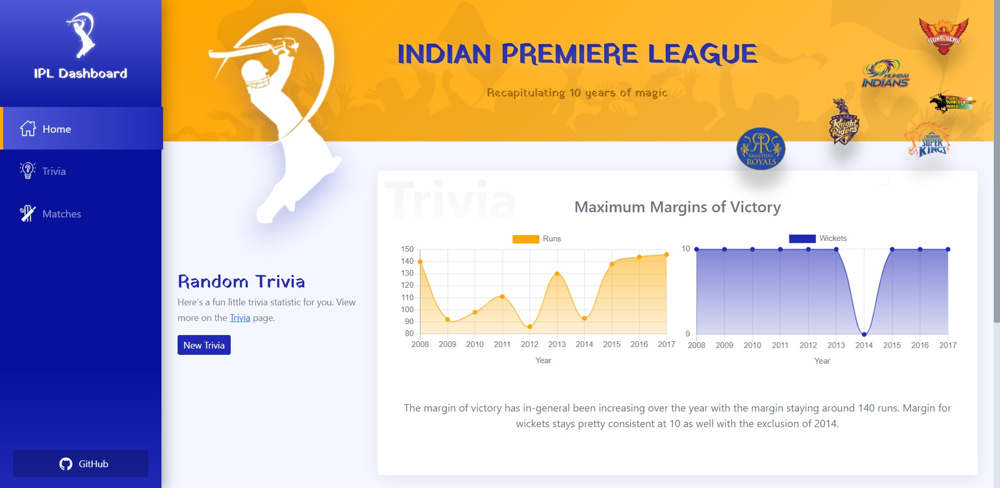

# IPL Dashboard



## Live Demo

[Click here to open the live demo](https://khushpanchariya21.github.io/ipl-dashboard/)
and explore Dashboard

## Description

This dashboard summarizes the past IPL history and trivia statistics. It offers many SPA functionalities like routing, basic state management, PWA and offline availability. All the data is used from a CSV file and have tried to make the system as dynamic as possible, allowing modifications to the CSV without affecting the core functionalities and chart generation.

## Key features

* **Home** view showing random trivia statistic and a match which was played on the same *date* as today.


* **Trivia** view with all the trivia stats listed for easy reference.


* **Matches** view contains a library for each and every match played between 2008 and 2017. It also allows multiple filtering and sorting of matches.


* Query-based route URLs (using match `id`) for each match for easy sharing.


* Fully dynamic chart creation using a custom-made component.

* Setup a seamless SCSS styling workflow for theming, making it as simple as updating one variable to change the look of the entire app.

* Completely responsive.
## Libraries used

* Vue.js 
* Vue Router - For PWA
* Chart.js- For statistics
* Bootstrap (for quick layout designing and theming)
* AOS (for some simple timed animations)

## Dataset

Indian Premier League (Match Analysis) by *UDITNAMDEV* (https://www.kaggle.com/uditnamdev/ipl-data)

## Bonus Points

✅ Built on Vue.js (with ❤)

✅ Optimized loading time 
* All static assets used (team logos, banner, etc) have been optimized for web.
* All icons are SVG based. 
* Minimal imports of external resources.
* Optimized time complexity by computing the trivia stats only once and using them throughout the app.

✅ Mobile responsive (mostly follows Fluid Design)

✅ Progressive Web App support (using Vue CLI PWA plugin)

✅ Usable offline (uses service-worker to cache the data)

## Design inspiration

* This beautiful dashboard from the following link https://dribbble.com/shots/5507197-Dashboard-Team-Coordination 
* Ton of Google searches for other components

## Project setup
```
npm install
npm run serve
```